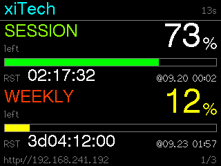
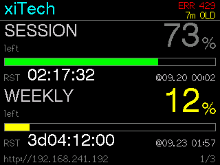
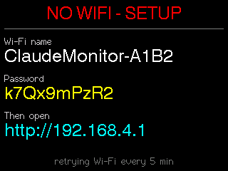

# Claude Usage Monitor — LILYGO T-Dongle-S3 (és ESP32-2432S028R / CYD)

Önálló, USB-ről táplált kütyü: Wi-Fi-n **közvetlenül** kérdezi le, mennyi maradt az AI-előfizetésed keretéből, és a
beépített 160×80-as kijelzőn mutatja. Nincs közbülső szerver, nincs felhős fiók: a tokenek az eszközön maradnak.

Spec: [`../ESP32_S3_Claude_Usage_Monitor_Brief_FINAL.md`](../ESP32_S3_Claude_Usage_Monitor_Brief_FINAL.md) ·
Mért alapok, döntések: [`PLAN.md`](PLAN.md) · Változások: [`CHANGELOG.md`](CHANGELOG.md)

> **Állapot (2026-09-18):** **a Claude-út vason fut**: Wi-Fi, OAuth-login, usage-lekérés `HTTP 200`, adat a kijelzőn;
> titkosított export/import, lezárt setup-oldal, webes kijelző-tükör (Playwright 25/25 és 18/18).
> **ChatGPT, Gemini, Grok: megírva, fordul, host-teszt zöld, vason MÉG NEM futott** (11.).
> Még nem mért: a Claude-token automatikus frissítése (~8 óra), a Wi-Fi nélküli képernyő, a 180°-os forgatás képe.
> Amit `⚠ [vason mérendő]` jelöl, az forrásból következik, nem mérésből.
> **ESP32-2432S028R (CYD), 2026-09-19:** két új env (`esp32-2432s028r` ILI9341, `esp32-2432s028r-st7789`), natív
> 320×240-es elrendezéssel. **Tisztán fordul, gépi renderrel ellenőrzött, de fizikai lapon NEM futott** (2/b.).

---

## 0. Mit tud a kütyü

**Egy mondatban:** bedugod egy USB-tápba, egyszer beállítod telefonról, és onnantól magától mutatja, mennyi van még hátra
a keretedből és mikor újul meg.

### Amit a kijelzőn látsz
- Profilonként: a **név**, a **session (5 órás)** és a **heti** keret **maradék százaléka**, mindkettőhöz **sáv**, és hogy
  **mikor újul meg** (visszaszámláló másodpercre + dátum: `RST 02:03:46 @09.18 12:30`).
- A **címke színe** a maradék szerint zöldből sárgán át pirosba vált.
- Több profil esetén **magától váltogat** (1–60 s, állítható).
- A jobb felső sarok 3 másodpercenként az **IP-címet** és az **állapotot** mutatja (adat kora, `NO WIFI`, `ERR 403`…).
- Wi-Fi nélkül vagy adat híján az **utolsó ismert reset-időpontokat** mutatja (ezek újraindítást is túlélnek).
- Hiba esetén beszédes képernyő: `RE-LOGIN NEEDED`, `NO WIFI - SETUP` (a beállító Wi-Fi nevével és jelszavával), `NTP ERR`, …
- A kijelző **180°-kal elforgatható**, ha fejjel lefelé áll a dongle.

### Milyen fiókot kezel
| Forrás | Bejelentkezés | Mit mutat | Állapot |
|---|---|---|---|
| **Claude** (claude.ai előfizetés) | on-device OAuth, PKCE: megnyitsz egy linket, jóváhagyod, a kapott kódot bemásolod | session + heti keret %-a és resetje | ✅ vason fut |
| **ChatGPT** (Codex-keret) | eszközkód: a felület mutat egy rövid kódot, azt az OpenAI oldalán írod be | 5 órás + heti ablak %-a és resetje | ⚠ vason nem futott |
| **Gemini** (Google AI / Code Assist) | Google-bejelentkezés, a kapott kódot bemásolod | modellenkénti maradék % és reset | ⚠ vason nem futott |
| **Grok** (SuperGrok / Grok CLI) | eszközkód az xAI oldalán | credit-% és a periódus vége | ⚠ vason nem futott |
| Claude web (`sessionKey`) | süti kézi bemásolása | mint a Claude-út | ⚠ 200-as válasz nem mért |

Legfeljebb **5 AI-profil** (akár különböző szolgáltatóktól) és **20 Wi-Fi-profil** tárolható. A token az eszközön marad,
és **magától frissül** — a bejelentkezést nem kell ismételgetni, amíg a frissítő token él.

### Hálózat
- **20 Wi-Fi-profil**, prioritással; induláskor és kapcsolatvesztéskor a legjobb elérhetőt választja, rossz jelszót
  gyorsan felismer, és lép a következőre.
- Ha egyik hálózat sem megy, **saját Wi-Fi-t nyit** (`ClaudeMonitor-XXXX`, WPA2, a jelszó a kijelzőn), és azon állítható be.
- **NTP-óra** és állítható **időzóna** — a reset-időpontok helyi időben látszanak.

### Beállítás és felügyelet böngészőből
- Teljes **setup-felület** (telefonbarát): Wi-Fi- és AI-profilok, megjelenítés, időzóna, mentés/visszatöltés, admin-jelszó.
- **Kijelző-tükör**: a `/screen` címen (külön ablakban is) pontosan az látszik, ami az LCD-n — a dongle a valódi
  képpontokat küldi.
- **Mentés/visszatöltés**: exportálható a teljes beállítás. Titkokkal együtt is, ilyenkor a fájlt a **dongle titkosítja**
  az admin-jelszóval (PBKDF2 + AES-256-GCM); dongle nélkül is visszafejthető (`tools/decrypt_backup.py`).

### Biztonság
- A titkok (Wi-Fi-jelszó, tokenek) **csak az eszközön** vannak, a felület soha nem adja vissza őket, a napló nem írja ki.
- Minden külső hívás **HTTPS**, beágyazott gyökértanúsítványokkal (`setInsecure()` nincs).
- **Opcionális admin-jelszó**: ha be van állítva, se módosítani, se megnézni nem lehet a beállításokat belépés nélkül;
  a nyitólap ilyenkor egy semleges bejelentkező oldal, ami magáról az eszközről semmit nem árul el.
- Elfelejtett jelszó esetén a BOOT gombos beállító mód a helyreállítási út (fizikai hozzáférés kell hozzá).
- ⚠ Az eszköz **sima HTTP**-t szolgál a helyi hálózaton: a jelszó és a bemásolt értékek titkosítatlanul utaznak odáig.
- ⚠ A használt kvóta-végpontok **nem hivatalos** API-k, más kliensek OAuth-azonosítójával. Bármikor eltörhetnek, és a
  szolgáltatási feltételekbe ütközhetnek; a Gemini-hez tartozó jogosultság a legszélesebb (lásd 11.).

---

## 1. Hardver

**LILYGO T-Dongle-S3** — a sima változat, nem a -Plus (projektgazda, 2026-09-16).

| | |
|---|---|
| SoC | ESP32-S3, 16 MB flash, **PSRAM nincs** |
| Kijelző | 0,96" ST7735, 160×80, SPI |
| Gomb | BOOT (GPIO 0) |
| Egyéb | APA102 RGB LED, microSD-foglalat, QWIIC — a firmware ezeket nem használja |

Kijelző-pinek (hivatalos LilyGO forrás, fájl:sor a [`PLAN.md`](PLAN.md) 1. pontjában):
MOSI 3, SCLK 5, CS 4, DC 2, RST 1, háttérfény 38.

## 2. T-Dongle-S3 board beállítás

A board-definíció a hivatalos LilyGO repóból van bemásolva: [`boards/dongles3.json`](boards/dongles3.json)
(`Xinyuan-LilyGO/T-Dongle-S3` @ `bb76546`). A [`platformio.ini`](platformio.ini) rögzíti:

- `platform = espressif32@6.12.0` (ugyanaz, mint a LilyGO-nál) → Arduino-ESP32 **2.0.17**;
- `board = dongles3`, partíciók `default_16MB.csv`;
- `TFT_eSPI 2.5.43`, a LilyGO `Setup209_LilyGo_T_Dongle_S3.h` értékeivel, build-flagként;
- `ArduinoJson 7`.

## 2/b. ESP32-2432S028R („Cheap Yellow Display", CYD) — második lapka, ⚠ vason NEM mért

A firmware a CYD-re **is** fordul, külön PlatformIO env-vel. A dongle env-je (`t-dongle-s3`) nem változott, és továbbra is
ez az alapértelmezett (`pio run`). A CYD-n a teljes Wi-Fi/HTTPS/OAuth/usage logika **ugyanaz a kód**. Csak a kijelző
más: **saját, natív 320×240-es (fekvő) elrendezése** van ([`src/display_cyd.cpp`](src/display_cyd.cpp)), nagyobb
betűkkel:

- **fejléc:** profilnév, jobbra az adat kora vagy a hiba (`ERR 429` + `7m OLD`);
- **keretenként egy blokk:** a címke a maradék szerint színezve, jobbra nagy számmal a **maradék %**, alatta sáv, és a
  **visszaszámlálás nagy betűvel**, mellette kicsiben a reset dátuma (`RST 02:17:32  @09.20 00:02`);
- **lábléc:** a setup-oldal címe (`http://<IP>`), több profilnál a sorszám (`1/3`).

A hibaképernyők (setup-AP, `RE-LOGIN NEEDED`, utolsó ismert resetek, betöltés) ugyanazok, mint a dongle-on, csak nagyobbak.

| Két keret | Hiba régi adat felett | Setup-AP |
|---|---|---|
|  |  |  |

> A képek **gépi renderek, nem fotók**: a valódi `display_cyd.cpp` fut a Mac-en, a TFT_eSPI saját font-tábláival
> (`sh test/host/render_cyd.sh <mappa>`). Az elrendezés geometriáját mutatják (mi fér ki, mi hová kerül). A panelt
> (driver, színek, fényerő, olvashatóság 2,8 hüvelyken) **nem**: az csak vason dől el.

**Webes kijelző-tükör (`/screen`):** a CYD-n is a **teljes, pontos kép** jön, 320×240-ben. Teljes képernyős puffer
nincs, ezért kérésre ugyanaz a rajzoló kód sávonként újra kirajzolja, és sávonként küldi el (6 × 25,6 KB = 153,6 KB
képenként, másodpercenként egyszer, amíg a tükör nyitva van). A dongle-on marad a 160×80.

> ⚠ **Fizikai CYD-lapon semmi nincs lemérve** (2026-09-19). A build tiszta, a beállítások három közösségi forrásból
> jönnek (fájl:sor a [`PLAN.md`](PLAN.md) 2.15-ben). **Nyitott, és csak vason dől el:** a kijelző-driver, a színsorrend,
> az invertálás, a forgatás iránya, a háttérfény szintje, és hogy a szabad heap elég-e a TLS-kézfogáshoz a klasszikus
> ESP32-n.

| | |
|---|---|
| SoC | ESP32-WROOM-32 (klasszikus ESP32), **4 MB** flash, PSRAM nincs; USB-soros: CH340 |
| Kijelző | 2,8" 240×320 TFT, **ILI9341 vagy ST7789** (lap-revíziótól függ, lásd lent), HSPI |
| Pinek | MISO 12, MOSI 13, SCLK 14, CS 15, DC 2, RST = a lap RST-je, háttérfény 21 (aktív HIGH) |
| Gomb | BOOT (IO0), ugyanúgy, mint a dongle-on |
| Nem használt | XPT2046 érintő (külön SPI: 25/32/33/36/39), SD, hangszóró, LDR; az RGB-LED-et (4/16/17, aktív LOW) induláskor kikapcsolja |
| Partíciók | `min_spiffs.csv`: app 1,875 MB. A `default.csv` 1,25 MB-os app-helye 91,2 %-ig telt volna (mérve). |

### Melyik env-et flasheljem?

| A lapod | Env | Ha rossz a kép |
|---|---|---|
| **Egy micro-USB** csatlakozó (az eredeti CYD) | `esp32-2432s028r` (ILI9341) — **ezzel kezdd** | lásd a következő sort |
| **Csak USB-C** (a rzeldent-féle „Rv2") | `esp32-2432s028r` (ILI9341) | Invertált színek (fekete háttér helyett fehér) → a env `build_flags`-éhez: `-DTFT_INVERSION_ON=1` |
| **USB-C + micro-USB** („CYD2USB", „Rv3"), vagy „7789" felirat a dobozon | `esp32-2432s028r-st7789` | Piros és kék felcserélve → `-DTFT_RGB_ORDER=TFT_RGB`. Invertált színek → `-DTFT_INVERSION_ON=1` a `-DTFT_INVERSION_OFF=1` helyett. |

A ST7789-es lap színsorrendjében **a források nem egyeznek**: a witnessmenow BGR-t ír, a rzeldent RGB-t. Az env a
witnessmenow-féle beállítást követi. Ha a kép fejjel lefelé áll, azt a setup-oldal forgatás-pipája javítja, ugyanúgy,
mint a dongle-on.

```sh
cd ClaudeUsageMonitor
pio run -e esp32-2432s028r                                          # vagy: -e esp32-2432s028r-st7789
pio run -e esp32-2432s028r -t upload --upload-port <a CH340 soros portja>
```

Mérve (2026-09-19, tiszta build, 0 warning, natív elrendezéssel): `esp32-2432s028r` RAM 70 952 B, Flash 1 206 249 B
(61,4 %); `esp32-2432s028r-st7789` Flash 1 206 145 B.
Feltöltési paraméterek (`envdump`): 460 800 baud, bootloader **`0x1000`** (nem `0x0`, mint az S3-on), partíciók `0x8000`,
`boot_app0` `0xe000`, firmware `0x10000`. ⛔ A [`tools/flash.sh`](tools/flash.sh) **csak a dongle-ra** jó (esp32s3,
16 MB, `0x0`).

## 3. PlatformIO telepítés

macOS-en mérve (2026-09-16): `brew install platformio` → `PlatformIO Core, version 6.2.0`.
Másik út: VS Code + PlatformIO IDE bővítmény. Az első build letölti a platformot és a könyvtárakat.

## 4. Build

```sh
cd ClaudeUsageMonitor
pio run
```

Mérve (2026-09-17, tiszta build): `SUCCESS`, **0 warning** (a saját forrásokra `-Wall -Wextra` mellett is),
RAM 16,1 % (52 876 B), Flash 15,6 % (1 022 573 B).

⚠ **Zsákutca:** `pio run -v` (bőbeszédű mód) tiszta buildnél `FAILED`-et ad a `firmware.bin` lépésnél:
`TypeError: unsupported operand type(s) for +: '_Null' and 'str'`. Ez a PlatformIO 6.2.0 kiírásának
hibája, nem a kódé: ugyanaz a tiszta build `-v` nélkül `SUCCESS`, és elkészül a `firmware.bin`.

Gépi teszt a hardverfüggetlen részekre (idő-parszolás, formázás, usage-parser a valós mintán, kapu nyitva és zárva).
Az ArduinoJson-t a PlatformIO letöltéséből veszi, ezért előbb egy `pio run` kell:

```sh
sh test/host/run.sh     # fails=0, parser fails=0, parser fails=0
```

## 5. Upload — macOS, lépésről lépésre

Mért (2026-09-17, ezen a Macen, dongle nélkül): a build és az upload-parancs összeállítása. Ami a dongle
csatlakoztatása után történik, az `⚠ [vason mérendő]`.

**Előfeltételek**

| Mi | Érték | Honnan |
|---|---|---|
| PlatformIO Core | 6.2.0 (`brew install platformio`) | mérve |
| Feltöltő | `esptool.py` 4.9.0, a PlatformIO hozza (`tool-esptoolpy`) — külön telepíteni nem kell | mérve |
| Driver | nem kell: az ESP32-S3 natív USB-je CDC-ként látszik | ⚠ [vason mérendő] |
| Kábel/csatlakozó | a T-Dongle-S3 **USB-A dugó**. USB-C-s Machez USB-C → USB-A (anya) adapter kell | termék-kialakítás |
| Baud | 921600 (`boards/dongles3.json` `upload.speed`) | mérve (`pio run -t envdump`) |
| Flash-címek | bootloader `0x0`, partíciók `0x8000`, `boot_app0` `0xe000`, firmware `0x10000` | mérve (`envdump`) |

**Lépések**

1. Build (a dongle még nincs bedugva):
   ```sh
   cd ClaudeUsageMonitor
   pio run                      # elvárt: [SUCCESS], 0 warning
   ```
2. Nézd meg, milyen soros portok vannak **bedugás előtt**:
   ```sh
   pio device list
   ```
   ⚠ Ezen a Macen már van egy idegen soros eszköz: `/dev/cu.usbserial-140` (`1A86:7523`, CH340) — az **nem** a dongle.
3. Dugd be a dongle-t (gomb nélkül), és futtasd újra a `pio device list`-et. Az új sor a dongle.
   Várhatóan `/dev/cu.usbmodem…`, `303A:1001` (Espressif natív USB) `⚠ [vason mérendő]`.
4. Feltöltés **kiírt porttal**:
   ```sh
   pio run -t upload --upload-port /dev/cu.usbmodemXXXX
   ```
   Miért kell a port: a board-definíció `hwids`-e `303A:82C1`, ezt a natív USB-CDC-s firmware nem fogja mutatni.
   Ilyenkor a PlatformIO az összes ismert board ID-jával keres (`platformio/device/finder.py`, `find()` és
   `_find_known_device()`), és a CH340 (`1A86:7523`) is ismert ID. Így a rossz portra is tölthet.
5. Ha a feltöltés `Failed to connect` / `No serial data received` hibával leáll → **letöltési mód** (LilyGO
   `docs/en/t-dongle-s3/REAMDE.MD`):
   1. húzd ki a dongle-t;
   2. **nyomd és tartsd** a BOOT gombot, és közben dugd be;
   3. engedd el, `pio device list` → a port neve változhat;
   4. ismételd a 4. lépést az új porttal.
6. A letöltési módból indított feltöltés után **húzd ki, és dugd vissza gomb nélkül**. Különben a lapka letöltési
   módban marad, és a firmware nem indul.
7. Soros napló:
   ```sh
   pio device monitor -p /dev/cu.usbmodemXXXX -b 115200
   ```
   Elvárt első sor: `[main] LILYGO T-Dongle-S3, firmware 0.1.0` (`src/main.cpp`). Ha nem látszik, az újraindulás
   előtt kiírt sor elveszhetett (USB-CDC újracsatlakozik). Ilyenkor húzd ki és dugd vissza, a monitor fusson közben.
8. Kijelző: 3 s-ig `Press BOOT now for setup mode`, utána AP-képernyő (6. szakasz).

### 5/b. Feltöltés PlatformIO nélkül (host)

Ha a dongle olyan Machez van dugva, amin nincs PlatformIO, akkor ott csak az `esptool` kell. A fordítás máshol történik.
[`tools/flash.sh`](tools/flash.sh) ugyanazokat a paramétereket adja, mint a `pio run -t upload`
(`envdump` `UPLOADERFLAGS`; a `qio`-ból feltöltéskor `dio` lesz, `platform main.py` `_get_board_flash_mode`).

Mérve (2026-09-17, host, macOS 26.6.2, `/usr/bin/python3` 3.9.6, nincs brew/pio):
`~/cmon-flash/` = `venv` (`pip install esptool==4.9.0`) + a 4 bináris + `SHA256SUMS` + `flash.sh`. A script port nélkül
kilistázza a soros portokat. A dongle nélküli listában nincs `usbmodem`.

```sh
ssh host                        # vagy helyben a host-n
cd ~/cmon-flash
sh flash.sh                          # portlista bedugás ELŐTT
# dongle be →
sh flash.sh                          # az új /dev/cu.usbmodem… a dongle
sh flash.sh /dev/cu.usbmodemXXXX     # SHA256-ellenőrzés, majd írás
```

Letöltési mód, ha nem kapcsolódik: lásd az 5. szakasz 5–6. lépését. Új build után a 4 binárist és a
`SHA256SUMS`-t újra át kell másolni.

Opcionális, ha a gyári firmware maradéka zavar: `pio run -t erase --upload-port …`. Ez **törli az NVS-t is**
(Wi-Fi/Claude-profilok, AP-jelszó).

## 6. Első indítás

1. Bedugás után 3 másodpercig a kijelzőn: `Press BOOT now for setup mode` (lásd 7.).
2. Ha még nincs Wi-Fi-profil, a lapka nem talál ismert hálózatot → **AP fallback** indul.
3. A kijelzőn megjelenik az AP neve, a jelszava és a cím.
4. Csatlakozz az AP-ra, nyisd meg a `http://192.168.4.1` címet, vegyél fel Wi-Fi- és Claude-profilt.
5. Wi-Fi-profil mentése után a lapka rögtön megpróbál csatlakozni. Siker esetén az AP leáll, és a
   setup-oldal a lapka új, helyi IP-címén érhető el (a kijelző kiírja, ha nincs Claude-profil).

A konfiguráció NVS-ben van, újraindítás és firmware-frissítés után is megmarad.

## 7. AP fallback és forced setup

- **SSID:** `ClaudeMonitor-XXXX`, ahol `XXXX` a MAC-cím utolsó két bájtja.
- **Jelszó:** első induláskor generált, 10 karakteres véletlen jelszó (WPA2-PSK), NVS-ben tárolva.
  AP-módban a kijelzőn látszik.
  *Eltérés a spectől:* a spec `Setup-A3F2` mintájában a jelszó a sugárzott SSID-ből kiolvasható, tehát nem titok.
- **Cím:** `http://192.168.4.1`
- **Fallback:** ha egyik Wi-Fi-profil sem működik. 5 percenként újrapróbál, ha nincs kliens az AP-n.
  Profil mentésekor azonnal újrapróbál.
- **Forced setup:** a BOOT gombot **bedugás után**, a 3 s-os ablakban kell megnyomni, vagy futás közben
  5 s-ig nyomva tartani. Ilyenkor az AP akkor is elindul, ha a mentett Wi-Fi elérhető. Kilépni
  a setup-oldal **Restart** gombjával lehet.
  *Eltérés a spectől:* a spec „induláskor nyomva tartást" ír, de a bedugáskor nyomott BOOT a lapkát
  letöltési módba teszi, és a firmware el sem indul (LilyGO doksi, lásd 5.).

## 8. Több Wi-Fi profil

Legfeljebb **20** profil (hordozható eszköz, sok helyszín): SSID, jelszó, engedélyezve, prioritás (-1000…1000, a nagyobb az előnyösebb).
A setup-oldalon felvehető, szerkeszthető, törölhető, tiltható, a **Scan** gombbal pedig a látható
hálózatok közül választható SSID.

Választás induláskor és kapcsolatvesztéskor:

1. scan;
2. az engedélyezett profilok közül azok, amelyek látszanak;
3. prioritás szerint csökkenő sorrend, azonos prioritásnál az erősebb jel (RSSI);
4. sorban próbálja, jelöltenként legfeljebb 15 s-ig. **Rossz jelszónál nem várja ki**: a Wi-Fi-driver bontási okából
   (pl. `15 4WAY_HANDSHAKE_TIMEOUT`, `202 AUTH_FAIL`) felismeri, és lép a következőre. Mérve: rossz jelszó → 5,3 s.
5. ha egyik sem megy → AP fallback.

Mentés/törlés a setup-oldalon csak akkor bontja a meglévő kapcsolatot, ha az a **mostani** hálózatot érinti. Egy újonnan
felvett, nagyobb prioritású hálózatra az eszköz a következő kapcsolatvesztéskor vált. A scan ~6,5 s (mérve).

Szerkesztésnél az üresen hagyott jelszómező megtartja a tároltat. Nyílt hálózathoz pipáld be a
„clear stored password" jelölőt.

## 9. Több AI-profil (Claude, ChatGPT, Gemini, Grok)

Legfeljebb **5** profil: név (max. 12 karakter, a kijelzőn mindig látszik; üresen hagyva `Profile-XX`, ahol XX véletlen 00–99, ütközés nélkül), Source (Claude OAuth, ChatGPT, Gemini, Grok vagy Claude web,
lásd 11.), engedélyezve. OAuth-nál a tokent a bejelentkezés adja; web-nél Organization ID + sessionKey.

- Minden profil saját cache-t kap. Hiba esetén az utolsó érvényes adat megmarad, és a kijelző mutatja a korát.
- Profilonként **60 s**-onként frissít, a profilok egyenletesen eltolva (3 profil: 0 / 20 / 40 s).
  Egyszerre legfeljebb egy kérés megy.
- Hibánál visszalép: átmeneti hibánál duplázva, legfeljebb 15 percig; hitelesítési hibánál 10 percig
  (a szerver `x-should-retry: false`-t küld).
- Egy profil hibája a többit nem állítja meg.

## 10. Display rotation

A setup-oldal **Display & refresh** részén: profil-rotáció 1–60 s (alap 5 s), **180°-os elforgatás** (ha fejjel lefelé áll
a dongle; NVS `flip`, azonnal érvényes, `tft.setRotation(3)` — ⚠ [vason mérendő], hogy az ST7735-ofszetek forgatva is
stimmelnek-e), és a **usage-frissítés
profilonként 60–3600 s (alap 180 s)** — a usage lassan változik, a konzervatív alap kíméli a keretet és
csökkenti a lábnyomot. A rotáció **csak a megjelenített profilt** cseréli, lekérést nem indít: 1 s-os
rotációnál is a beállított frissítési idő marad. A „Claude requests since boot" számláló ezt mutatja.

**Kijelző-tükör a böngészőben** (projektgazda, 2026-09-18): a *Device* résznél **Open display mirror (live)**, vagy közvetlenül
a `/screen` cím (külön ablakban is). A dongle a **valódi framebuffert** adja ki (`GET /api/screen`, 160×80 RGB565, 25 600 B,
bájtcserélt — a kliens fordítja vissza), a böngésző 1 másodpercenként frissíti, felnagyítva. Belépés kell hozzá:
token nélkül `401`, a `/screen` oldal ilyenkor jelszót kér. Mérve (2026-09-18): 25 600 B, a kép a kijelzővel egyező.

Kijelző-elrendezés:

```
xiTech                     12s      0   profilnév (+ jobb felül IP / állapot)
SESSION             73% LEFT        16  cimke + maradék
[██████████████░░░░░░░░░░░░░]       32  sáv
RST 04:49:27 @09.17 21:00           40  reset
WEEKLY              59% LEFT        48
[████████████████████░░░░░░░]       64  sáv (2026-09-18 óta a hetinek is van)
RST 3d04:12:33 09.24 09:00          72
```

- A **cimke színe a maradék szerint** megy zöldből pirosba (100 % zöld, 50 % sárga, 0 % piros; `usageColor565`,
  host-teszttel). Régi vagy lejárt adatnál szürke.

- **Reset-sor:** hátralévő idő másodpercre járva, utána a reset **hó.nap óra:perc**-e helyi időben.
  - A kijelző 26 karakter széles. Napos visszaszámlálásnál a `@` elmarad, különben nem férne ki.
  - Mérve: `RST 16:49:27 @09.18 09:00`.
- `RST PASSED @09.17 16:00`: a keret lejárt, új adatra vár.
- `RST 09.18 09:00 (no clock)`: pontos idő nincs (NTP nélkül nincs hiteles visszaszámlálás).
- **Felső sor:** a profilnév mindig látszik. A jobb sarokban 3 s-onként váltakozik az **IP-cím** (csak Wi-Fi-kapcsolatnál)
  és az állapot. Az IP 90 px széles; ha a név 2-es betűvel mellette nem fér ki, az IP-fázisban kisebb betűvel, szükség
  esetén csonkítva jelenik meg.
- A jobb felső sarokban az adat kora (`3m OLD` sárgán, ha régebbi 2 frissítési ciklusnál), illetve `NO WIFI`,
  `NTP ERR` vagy `ERR 403`.

**Wi-Fi nélkül — utolsó ismert resetek:**
- Minden sikeres lekérés után a session- és a heti reset időpontja NVS-be kerül (namespace `cmonlk`, csak időpontok,
  titok nincs). Így újraindítás után is megvan.
- Ha nincs Wi-Fi vagy friss adat, a kijelzőn `SESSION (last known)` / `WEEKLY (last known)` + a reset-sor, és
  `data from MM-DD HH:MM` látszik.
- AP-fallbackban ez a nézet a setup-képernyővel váltakozik.
- A mentett időpontokat a firmware törli, ha a profilhoz más fiókkal lépsz be, vagy a profilt törlöd.
- ⚠ A Wi-Fi nélküli képernyőt vason még senki nem nézte meg; a mentés és a visszatöltés mérve van.

**Időzóna** (setup-oldal, *Time zone*): lista a gyakori zónákkal, vagy egyedi POSIX TZ-string. NVS-ben, alap
`CET-1CEST,M3.5.0,M10.5.0/3` (Budapest). A listaértékek a `/usr/share/zoneinfo/<zóna>` utolsó sorából vannak.
Vason mérve (newlib), UTC 13:54-kor: `JST-9` → 22:54, `<+04>-4` → 17:54, `IST-5:30` → 19:24, `EST5EDT…` → 09:54.
A `/api/status` `localTime`/`tz` mezője, és Claude-profilonként a `sessionReset`/`weeklyReset` szó szerint azt adja,
ami a kijelzőn van.

## 11. Claude authentication

Claude-profilonként a **Source** mezőben két út közül lehet választani (elsődleges: OAuth).

### OAuth — on-device bejelentkezés + automatikus frissítés (ajánlott)

Cél: egyszeri bejelentkezés után az eszköz **magától** frissíti a tokent, és beavatkozás nélkül fut.

0. Előfeltétel: az eszköz már **otthoni Wi-Fi-n** van, van pontos idő (NTP). AP-módban nincs internet, a kódcsere
   nem megy. Pontos idő nélkül a setup-oldal `503`-at ad; a függő login megmarad, a kód újra beküldhető.
1. A Claude-profil űrlapon (név elhagyható, `Source = OAuth`) nyomd meg a zöld **Authenticate now** gombot.
   Ez menti a profilt, és új fülön megnyitja a Claude jóváhagyó oldalát. Meglévő profilnál a sor **Authenticate** gombja.
2. Hagyd jóvá (olyan böngészőben, ahol be vagy jelentkezve a Claude-ba).
3. A megjelenő oldal ad egy kódot (`code#state` alak). Másold be az oldal alján megjelenő mezőbe → **Submit code**.
   Ha az új fül nem nyílt meg (popup-tiltás): **Open Claude sign-in page**.
5. Az eszköz tokenre cseréli, NVS-be írja, és onnantól **5 perccel lejárat előtt automatikusan frissít**.

- **Dedikált token:** a saját bejelentkezésed külön tokent ad, ezért nem ütközik a gépeden futó Claude Code-dal.
- Ha a frissítő token véglegesen érvénytelen lesz, a kijelzőn **RE-LOGIN NEEDED**, és a fenti lépéseket meg kell ismételni.
- Végpontok/azonosító a Claude Code kliensből (forrás: [`PLAN.md`](PLAN.md) 2.8–2.9). PKCE S256 + state (CSRF).

### ChatGPT, Gemini, Grok — ⚠ megírva, vason MÉG NEM futott (2026-09-17)

Ugyanaz a profil-lista és kijelző; a **Source** mezőben választható. Forrás és mérés (hamis tokennel):
[`PLAN.md`](PLAN.md) 2.13/b. Mindhárom **nem hivatalos, belső végpont**, egy másik alkalmazás (Codex CLI / Gemini CLI / Grok CLI)
nyilvános OAuth-kliensével. Bármikor eltörhet, és a szolgáltatási feltételekbe ütközhet ⚠ (ToS nincs átnézve).

| Source | Login a felületen | Mit mutat a kijelző |
|---|---|---|
| **ChatGPT** | *Authenticate now* → a felület mutat egy **rövid kódot** + megnyitja az `auth.openai.com/codex/device` oldalt → ott beírod és jóváhagyod. **Visszamásolni nem kell**, a dongle maga kérdezi le. | Codex-keret: `5H WINDOW` és `WEEKLY` (használt %, reset). A sima ChatGPT-üzenetkeretre nincs végpont. |
| **Gemini** | *Authenticate now* → Google-bejelentkezés → a `codeassist.google.com` oldal kiír egy kódot → bemásolod. **Előtte a Gemini CLI-t egyszer használni kell** (onboarding, `loadCodeAssist` project). | Modellenként (pl. `2.5 PRO`, `2.5 FLASH`) a használt % = 100 × (1 − `remainingFraction`), reset. |
| **Grok** | *Authenticate now* → **rövid kód** + `accounts.x.ai/oauth2/device` → beírod, jóváhagyod. | `CREDITS` (használt %), reset a számlázási időszak végén. |

- **Tokenek:** az új szolgáltatóknál az access token **csak RAM-ban** van (akár 2 KB, nem férne az NVS-be), az NVS-ben a refresh token
  (max. 512 kar.) és az account-/project-ID. Újraindítás után egy refresh pótolja; a rotált refresh token azonnal NVS-be kerül.
- **Végleges refresh-hiba** → `RE-LOGIN NEEDED` (Google/xAI: `invalid_grant`; OpenAI: `401` + `refresh_token_*`/`token_expired`).
- ⚠ **Gemini-scope:** a Gemini CLI kliense `cloud-platform` scope-ot kér (teljes Google Cloud-hozzáférés). Az eszközön tárolt refresh token
  ennyit ér: aki a dongle NVS-ét kiolvassa, a Google Cloud-fiókhoz is hozzáfér. Admin-jelszó + titkosított export ajánlott.
- **TLS:** a CA-csomagba bekerült a **GTS Root R1** (googleapis.com); mind a 9 használt hoszt `0 (ok)` (openssl, 2026-09-17).
- **Host-teszt:** `test/host/test_providers.cpp`. A minták **szintetikusak**, a forrásbeli sémából; a valós válaszalak vason mérendő.
  Mutációs próba: a Gemini-képlet és a heti ablak felismerésének elrontását elkapta.

### sessionKey (claude.ai web) — másodlagos, kézi

`Source = claude.ai web`: Organization ID (UUID) + a `sessionKey` süti értéke. Nincs automatikus frissítés;
a linuxlewis `SPEC.md` szerint a süti ~30 napos, tehát időnként újra be kell másolni. ⚠ Ezen az úton a 200-as
választ még nem mértük.

A tárolt titkok (access/refresh token, sessionKey) soha nem jelennek meg újra: a setup-oldal csak az állapotot
mutatja (nincs bejelentkezve / token, lejárat / set). NVS-ben tárolva, nem logolva, a kijelzőn nem látszanak.

✅ **Vason mérve (2026-09-17):**
- a login a projektgazda fiókjával sikerült (`code#state` kód), az első usage-lekérés `HTTP 200`, 2326 B, `limits[]` 3 limit;
- újraindítás után a tokenek megmaradtak, a lekérés újra `200` volt.

⚠ Még nem mért: az automatikus token-frissítés (~8 óra után), és a frissítő token élettartama.

⚠ Az eszköz a Claude Code OAuth-kliensazonosítójával lép fel. Ez nem harmadik félnek szánt API; az Anthropic
feltételei szerint kifogásolható lehet. Személyes, saját usage-figyelésre, a projektgazda vállalásával.

## 12. Endpoint

Nem hivatalos, nem stabil API-k. Mért tények: [`PLAN.md`](PLAN.md) 2.

```
web:   GET https://claude.ai/api/organizations/{organization_uuid}/usage
OAuth: GET https://api.anthropic.com/api/oauth/usage
```

- **claude.ai**: HTTP/1.1-en az origin JSON-t válaszol, HTTP/2-n Cloudflare-kihívás jön. Rossz UUID esetén `400`,
  rossz session esetén `403 account_session_invalid`.
- **api.anthropic.com**: hamis tokenre `401 authentication_error`, hitelesítés nélkül `429` + `Retry-After`
  (a firmware betartja, legfeljebb 1 óráig).
- **Válasz** (valós minta, OAuth-út: [`test/host/fixtures/`](test/host/fixtures/)):
  - elsődleges a `limits[]` (`session`, `weekly_all`, `weekly_scoped`; `percent` 0–100, `severity`, `resets_at`);
  - tartalék a `five_hour` / `seven_day` (`utilization` 0–100, `resets_at`).
  - A kijelző `severity: "warning"` esetén sárgán mutat.
- **Parser-kapu**: alapból nyitva. Ha a Claude API változik és gyanús az adat: `PLATFORMIO_BUILD_FLAGS="-DUSAGE_PARSER_ENABLE=0"`.
- **TLS**: ISRG Root X1 + X2 (claude.ai) és **GTS Root R4** (api.anthropic.com), `src/ca_certs.h`.

## 13. Hibaelhárítás

| Kijelző | Jelentés | Teendő |
|---|---|---|
| `NO WIFI - SETUP` + SSID/PASS | egyik Wi-Fi-profil sem működik | csatlakozz az AP-ra, ellenőrizd a profilokat |
| `NO WIFI` a sarokban + `waiting WiFi` (Claude-profil nélkül: `WIFI scanning/connecting`) | csatlakozás folyamatban vagy megszakadt | várj (jelöltenként max. 15 s); ha nem jön, AP fallback indul |
| `waiting NTP` / `NTP ERR` / `RESET ? (NO TIME)` | nincs pontos idő (TLS-hez is kell) | internetkapcsolat, UDP 123 engedélyezése |
| `NO INTERNET` | DNS/TCP/TLS hiba | hálózat; ha tartós: tanúsítványlánc-váltás (12.) |
| `TIMEOUT` | 10 s alatt nem jött válasz | automatikusan újrapróbál |
| `CLOUDFLARE` / `ERROR 403` | Cloudflare-kihívás a claude.ai-on — **csak sessionKey (web) profilnál** várható; az OAuth-út hosztjai nem adnak kihívást (mérve) | sessionKey-nél: ⚠ [vason mérendő], lásd PLAN 2.1; javasolt OAuth-profilra váltani |
| `RE-LOGIN NEEDED` | OAuth: a frissítő token véglegesen érvénytelen | jelentkezz be újra (11.) |
| `TOKEN REFRESH` | OAuth: a tokenfrissítés átmenetileg nem sikerült | automatikusan újrapróbál |
| `CLAUDE AUTH` / `ERROR 403` vagy `401` | lejárt vagy rossz session/token | OAuth-nál magától frissít; sessionKey-nél új érték a profilba |
| `RATE LIMIT` / `ERROR 429` | túl sok kérés — vagy api.anthropic.com-on hiányzó hitelesítés (mérve) | automatikus visszalépés, `Retry-After` szerint |
| `CLAUDE HTTP` / `ERROR nnn` | egyéb HTTP-hiba | a soros napló a státuszkódot kiírja |
| `USAGE PARSE` | a válasz nem JSON, vagy se `limits[]` session/weekly, se `five_hour`/`seven_day` nincs benne | a Claude API változhatott → `usage_parser` |
| `PARSER TODO` | a parser kapuja build-flaggel zárva (`USAGE_PARSER_ENABLE=0`) | fordítsd újra a flag nélkül |
| `NOT SET UP` | hiányzik az Organization ID vagy az auth | setup-oldal |

Elfelejtett admin-jelszó: forced setup (7.), abban a módban nem kell jelszó.

### Beállítások mentése: export / import

A setup-oldal **Backup (export / import)** részén.

- **Export settings**, *include secrets* nélkül → `device-config-ÉÉÉÉ-HH-NN.json`: olvasható JSON, titok nélkül.
  Tartalma: Wi-Fi- és Claude-profilok (jelszó/token nélkül), rotáció, frissítés, időzóna.
- **Export settings**, *include secrets*-szel → `…-ENCRYPTED.json`, a Wi-Fi-jelszavakkal és a Claude-tokenekkel.
  - A felület bekéri a mostani admin-jelszót, a dongle **újra ellenőrzi** (a hibás próbálkozás a loginnal közösen zárol).
  - A fájlt a dongle titkosítja: PBKDF2-HMAC-SHA256 (16 bájt só, 25 000 kör) → AES-256-GCM (12 bájt IV, 16 bájt tag,
    AAD = `device-config-encrypted/1`), `src/backup_crypto.*`.
  - A fájlban semmi olvasható nincs: se SSID, se profilnév.
  - A böngészőben ez nem mehet, mert a WebCrypto API sima HTTP-n (nem *secure context*) nem érhető el.
  - Olvasható titok-export nincs: `GET /api/export?secrets=1` → `400`.
- **Import settings**: minden Wi-Fi- és Claude-profilt, a megjelenítést és az időzónát lecseréli (megerősítést kér).
  - **Titkosított fájlnál** bekéri az exportkor érvényes admin-jelszót. Ez független a mostanitól, tehát másik dongle-on
    vagy jelszócsere után is működik. Rossz jelszónál a GCM-ellenőrzés miatt biztosan hibát ad, és semmi nem változik.
  - Titok nélküli fájlnál a dongle-on **meglévő** jelszó és token marad (azonos SSID, illetve azonos Claude-név + forrás).
  - Az AP-jelszó és az admin-jelszó marad. Egy visszatöltött Claude-token közben lejárhatott vagy rotálódhatott → *Authenticate*.
- **Dongle nélkül:** [`tools/decrypt_backup.py`](tools/decrypt_backup.py) (`pip install cryptography`); `--summary` csak neveket és hosszakat ír.
- ⚠ A jelszó exportkor és importkor is sima HTTP-n megy a helyi hálón (mint a loginnál); a fájl maga védett.
- Mérve (2026-09-17):
  - PBKDF2 100 000 kör = **9034 ms** (túl lassú) → 25 000 kör = **2258 ms**;
  - `test/e2e/backup.test.js` **18/18**: olvasható export titok nélkül; titok olvasható formában nem kérhető; jelszó nélkül és
    rossz jelszóval elutasítva; titkosított fájlban nincs olvasható SSID/név; **független Python-visszafejtés** (jó jelszóval OK,
    rosszal `InvalidTag`); import rossz jelszóval hiba és változatlan konfig; import jó jelszóval és titok nélkül is azonos konfig
    (a tokenek megmaradtak), a lekérés `HTTP 200`.

**Felület-teszt:** `test/e2e/setup_ui.test.js` (25/25). Login-héj, rossz és jó jelszó, Claude-profil mentés/átnevezés/
*Authenticate* (új fül az authorize URL-lel), `Profile-XX`, ékezetes név elutasítva, Wi-Fi-profil mentés/törlés
újratöltés nélkül, időzóna, megjelenítés, scan, újratöltés, kijelentkezés. Csak TESZT-adatot hoz létre és töröl. Futtatás
a fájlok fejlécében; a jelszót fájlból olvassa (`CMON_PW_FILE`), a repóban nincs.

## 14. Biztonsági megjegyzések

- Titok (Wi-Fi-jelszó, Claude session) csak NVS-ben van. Nincs a kódban, nincs Serial-logban, nincs
  a kijelzőn, és a setup-oldal sem küldi vissza.
- Claude felé csak HTTPS, tanúsítvány-ellenőrzéssel. `setInsecure()` nincs. HTTP-timeout 10 s,
  a válasz legfeljebb 16 KB.
- Az AP mindig WPA2-PSK, véletlen jelszóval.
- **Admin-jelszó (opcionális):**
  - Ha be van állítva, minden módosító kéréshez (mentés, törlés, scan, restart) belépés kell.
  - NVS-ben csak só + PBKDF2-HMAC-SHA256 (4096 iteráció) kivonat van, a jelszó maga nincs.
  - Belépés után memóriában tartott token jár, 30 perc tétlenség után lejár.
  - 5 hibás próbálkozás után 60 s zárolás.
  - Forced setup módban nem kell jelszó (fizikai hozzáférés = helyreállítás).
- A módosító kérések `X-CMon: 1` fejlécet kívánnak (CSRF ellen). A dinamikus adat `textContent`-tel
  kerül az oldalba (a scannelt SSID idegen adat).
- ⚠ Az eszköz **sima HTTP**-t szolgál ki: az admin-jelszó és a beírt session-érték titkosítatlanul
  megy át a helyi hálózaton vagy az AP-n.
- **Olvasás is jelszóhoz kötött** (2026-09-17, a projektgazda kérésére), ha van admin-jelszó:
  - a `/api/config` és a `/api/scan` (GET) token nélkül `401`;
  - a `/api/status` zárolva csak `{"locked":true}`-t ad (se típus, se verzió);
  - a `/` belépés nélkül egy **semleges login-héj** (1624 B, `<title>Login</title>`). Nincs benne terméknév, felirat vagy
    API-lista; mérve, grep: `claude|monitor|lilygo|dongle|esp32|anthropic|oauth|firmware` → 0 találat.
  - A valódi felület a `/api/ui`-ról jön, csak érvényes tokennel (token nélkül `401`);
  - az 5 s-os status-lekérdezés nem hosszabbítja a munkamenetet, így 30 perc tétlenség után lejár.
  - Mérve token nélkül: 12 módosító végpont + `config`/`scan` → `401`, rossz tokennel is `401`.
    A belépett ág a projektgazda böngészőjében mérendő.
  - ⚠ Továbbra is elárulja az eszközt: az AP-mód SSID-je (`ClaudeMonitor-XXXX`, 7.). A Wi-Fi DHCP-hostnév
    alapértéke ⚠ [feltárandó] (az Arduino-core-ban `esp32s3-…` lehet).
- A hibás JSON nem okoz összeomlást: az ArduinoJson hibakódot ad, a firmware `USAGE PARSE`-t mutat.

## 15. Ismert korlátozások

- **Vason mérve (2026-09-17/18):** flash, kijelző, háttérfény, Wi-Fi-állapotgép, AP, webszerver, TLS, NTP,
  Claude OAuth-login + usage-lekérés (`HTTP 200`), titkosított export/import, kijelző-tükör.
- **Vason NEM mért:** a ChatGPT/Gemini/Grok utak (login, valós válaszalak, token-hosszak), a Claude-token automatikus
  frissítése (~8 óra), a Wi-Fi nélküli „utolsó ismert reset" képernyő, a 180°-os forgatás képe, a `refresh_token` élettartama.
- **Csak a sessionKey (claude.ai) tartalék-úton:** a Cloudflare dönthet úgy, hogy az ESP32-t nem engedi át (más
  TLS-ujjlenyomat, mint a curl-é). Az elsődleges OAuth-utat ez nem érinti: az eszköz ott csak az `api.anthropic.com`-ot
  és a `platform.claude.com`-ot hívja, ezek nem adnak kihívást (mérve), a login pedig a telefonon zajlik.
- A web (sessionKey) úton a `200`-as válasz nincs mérve.
  A frissítő token élettartama feltárandó (a Mac-en mérve ~21,6 nap, de hogy az eszközön mikor kell mégis újra belépni, nyitott).
- Nem hivatalos API-k (mind a négy szolgáltatónál): bármikor megváltozhatnak. A javítás helye a `claude_client`
  (`kTransports[]`, `fetchProvider`), a `provider_auth` és a `usage_parser`.
- 5 AI-profil a felső korlát, és az NVS mérete is határ: 20 Wi-Fi- + 5 token-profil elfér, ennél több már mérendő.
- Rejtett (nem sugárzott) SSID nem támogatott.
- A tanúsítványlánc gyökere változhat (Cloudflare kiadót válthat) → új gyökér a `src/ca_certs.h`-ba.
- `time_t` 32 bites (Arduino-ESP32 2.0.17) → 2038-ig.
- Nincs OTA-frissítés: firmware csak USB-n.
- **CYD (ESP32-2432S028R):** csak build és gépi render van, fizikai lapon semmi nem futott (2/b.). Nyitott: a
  kijelző-driver és a színek, az olvashatóság, a képidő, és a heap-tartalék a TLS alatt. Az érintőképernyő nincs használva.
