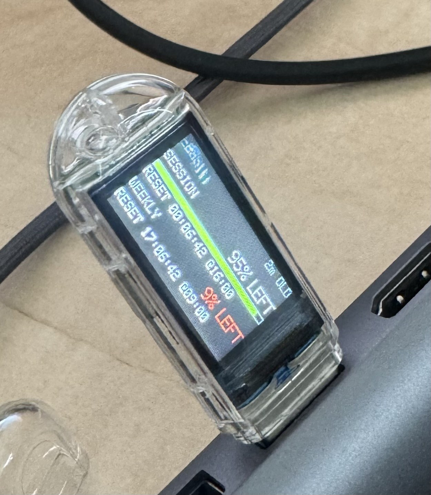
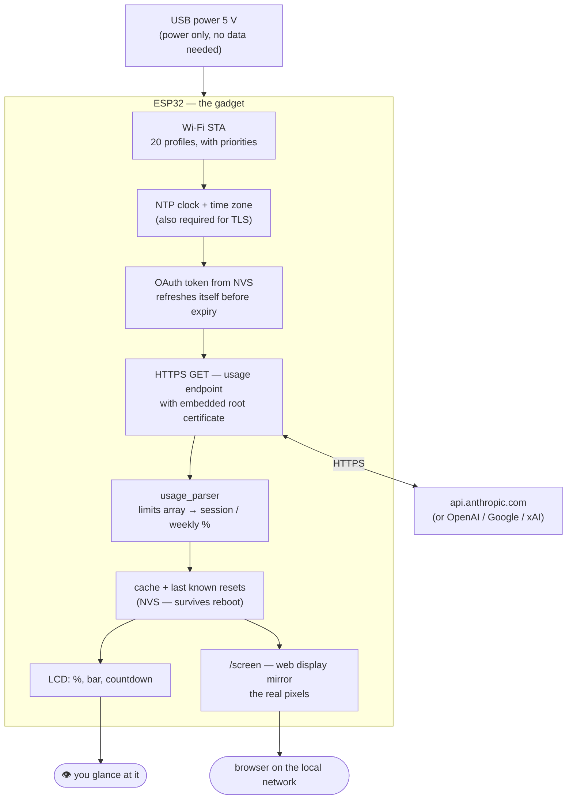
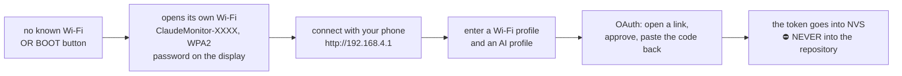
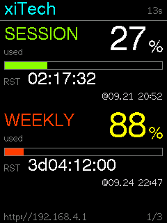
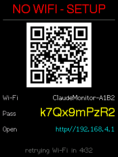
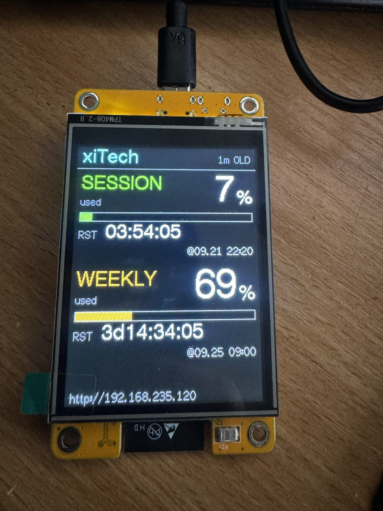

# Claude Usage Monitor — LILYGO T-Dongle-S3 & ESP32-2432S028R (CYD)

A self-contained, USB-powered gadget that asks **directly over Wi-Fi** how much is left of your AI subscription
quota, and shows it on its built-in display. No intermediate server, no cloud account: **your tokens never leave
the device.**



> 🤖 **Vibecoded end-to-end with [Claude](https://claude.com/claude-code).** The firmware, the tooling and this documentation were all designed and written with Claude.

🇭🇺 *Magyar változat: [`README.hu.md`](README.hu.md)* ·
Spec: [`docs/ESP32_S3_Claude_Usage_Monitor_Brief_FINAL.md`](docs/ESP32_S3_Claude_Usage_Monitor_Brief_FINAL.md) ·
Changes: [`CHANGELOG.md`](CHANGELOG.md)

> **Status (2026-09-18):** **the Claude path runs on real hardware**: Wi-Fi, OAuth login, usage fetch `HTTP 200`,
> data on the display; encrypted export/import, locked-down setup page, web display mirror (Playwright 25/25 and 18/18).
> **ChatGPT, Gemini, Grok: written, compiles, host tests green, but have NOT yet run on hardware** (§11).
> Not yet measured: automatic Claude token refresh (~8 hours), the no-Wi-Fi screen, the 180° rotation image.
> Anything marked `⚠ [to be measured on hardware]` follows from source reading, not from measurement.
>
> **ESP32-2432S028R (CYD), 2026-09-21: first run on a physical board** (a USB-C + micro-USB board, ESP32-D0WD-V3):
> picture, colours (with the new `esp32-2432s028r-inv` env), rotation incl. 90° portrait, backlight, Wi-Fi, and the
> first real HTTPS call (`HTTP 200`, usage parsed) are **measured** (§2/b).

---

## 0. What it does

**In one sentence:** plug it into a USB power supply, set it up once from your phone, and from then on it shows by
itself how much of your quota is left and when it renews.

### What you see on the display
- Per profile: the **name**, the **session (5-hour)** and the **weekly** quota **percentage used** (as on claude.ai's Usage page, labelled `SESSION used` / `WEEKLY used`), a
  **remaining** bar for each, and **when it renews** (countdown to the second plus date: `RST 02:03:46 @09.18 12:30`).
- The **label and bar colour** shifts from green through yellow to red as the remainder drops.
- With several profiles it **cycles automatically** (1–60 s, configurable).
- The top-right corner alternates every 3 seconds between the **IP address** and the **status** (data age, `NO WIFI`,
  `ERR 403`, …).
- Without Wi-Fi or data it shows the **last known reset times** (these survive a reboot).
- Clear error screens: `RE-LOGIN NEEDED`, `NO WIFI - SETUP` (with the setup Wi-Fi name and password), `NTP ERR`, …
- The display can be **rotated 180°** if the dongle sits upside down; on the CYD also **90°/270° (portrait)**.

### Which accounts it handles
| Source | Sign-in | What it shows | Status |
|---|---|---|---|
| **Claude** (claude.ai subscription) | on-device OAuth, PKCE: open a link, approve, paste back the code | session + weekly quota % and reset | ✅ runs on hardware |
| **ChatGPT** (Codex quota) | device code: the UI shows a short code, you enter it on OpenAI's page | 5-hour + weekly window % and reset | ⚠ not run on hardware |
| **Gemini** (Google AI / Code Assist) | Google sign-in, paste back the code | remaining % and reset per model | ⚠ not run on hardware |
| **Grok** (SuperGrok / Grok CLI) | device code on xAI's page | credit % and end of period | ⚠ not run on hardware |
| Claude web (`sessionKey`) | paste the cookie manually | same as the Claude path | ⚠ 200 response not measured |

Up to **5 AI profiles** (from different providers if you like) and **20 Wi-Fi profiles** can be stored. The token stays
on the device and **refreshes itself** — you do not have to repeat the sign-in while the refresh token lives.

### Networking
- **20 Wi-Fi profiles** with priorities; at boot and on connection loss it picks the best available one, detects a wrong
  password quickly and moves on to the next.
- If no network works it **opens its own Wi-Fi** (`ClaudeMonitor-XXXX`, WPA2, password shown on the display) and can be
  configured over that.
- **NTP clock** and a configurable **time zone** — reset times are shown in local time.

### Setup and monitoring from a browser
- Full **setup UI** (phone-friendly): Wi-Fi and AI profiles, display, time zone, backup/restore, admin password.
- **Display mirror**: at `/screen` you see exactly what is on the LCD — the device sends the real pixels.
- **Backup/restore**: the whole configuration can be exported. Secrets can be included, in which case **the device
  encrypts** the file with your admin password (PBKDF2 + AES-256-GCM); it can be decrypted without the device
  (`tools/decrypt_backup.py`).

### Security
- Secrets (Wi-Fi passwords, tokens) exist **only on the device**; the UI never hands them back and the log never prints them.
- Every outbound call is **HTTPS** with embedded root certificates (there is no `setInsecure()`).
- **Optional admin password**: when set, the settings can neither be changed nor even read without signing in; the
  landing page is then a neutral login shell that reveals nothing about the device.
- If you forget the password, BOOT-button setup mode is the recovery path (physical access required).
- ⚠ The device serves **plain HTTP** on the local network: the password and any pasted values travel unencrypted to it.
- ⚠ The quota endpoints used are **unofficial** APIs, accessed with other clients' OAuth identifiers. They may break at
  any time and may conflict with the providers' terms of service; the Gemini scope is the broadest (see §11).

---

## 0/b. Which devices it runs on

Two board families are supported by **the same firmware** — only the display layer differs. The difference lives in the
PlatformIO env; you never have to touch source code.

| Board | SoC / flash | Display | PlatformIO env | Verified on hardware? |
|---|---|---|---|---|
| **LILYGO T-Dongle-S3** (the plain one, not the -Plus) | ESP32-S3, 16 MB, no PSRAM | 0.96" **ST7735**, 160×80 | `t-dongle-s3` *(default)* | ✅ **YES** — 2026-09-17/18, measured end to end on a real board |
| **ESP32-2432S028R "CYD"** — single micro-USB (original), or USB-C only ("Rv2") | ESP32-WROOM-32, 4 MB, no PSRAM | 2.8" **ILI9341**, 320×240 | `esp32-2432s028r` | ⚠ **NO** — not this revision |
| **ESP32-2432S028R "CYD"** — USB-C + micro-USB, ILI9341 with inverted colours (ours) | ESP32-D0WD-V3, 4 MB, no PSRAM | 2.8" **ILI9341**, 320×240 | `esp32-2432s028r-inv` | ✅ **YES** — 2026-09-21, display + Wi-Fi + HTTPS `200` |
| **ESP32-2432S028R "CYD"** — USB-C + micro-USB ("CYD2USB" / "Rv3"), ST7789 variant | ESP32-WROOM-32, 4 MB, no PSRAM | 2.8" **ST7789**, 320×240 | `esp32-2432s028r-st7789` | ⚠ **NO** — not tried |

> **Said plainly:** the CYD has run on **one** physical board (2026-09-21, a two-connector board that turned out to be
> ILI9341 with inverted colours, not ST7789). Measured there: picture, colours, rotation (0° and 90°), backlight, Wi-Fi,
> and HTTPS `200` with heap to spare. The other two revisions (original micro-USB, ST7789) have **not** run. See §2/b.

**Nothing but the display differs:** Wi-Fi handling, TLS, OAuth, fetching, caching, the setup UI and the web mirror are
**bit-for-bit the same code** on both boards.

---

## 0/c. How it works

### Data flow

There is no intermediate server and no cloud account: the device calls the provider's API **directly**, and the tokens
stay on the device throughout.



**Setup path** — this is where you supply **your own** credentials, at runtime:



### Credentials are never in the source

This is a rule of the project, stated on the very first line of the code (`src/config.h:1` — *"no secret may live here"*):

- You supply the Wi-Fi password and the AI tokens **at runtime**, through the setup UI; they are stored in **NVS**.
- The repository contains **no** `.env`, no hard-coded key, and `.gitignore` excludes such files.
- The UI **never hands secrets back**, the serial log does not print them, and they never reach the display.
- The `CLIENT_ID`s present in the source are **public** OAuth client identifiers (in OAuth the `client_id` is public by
  definition — it appears in the authorize URL the user sees; the origin is cited file:line in `src/config.h`). The one
  `CLIENT_SECRET` belongs to Google's **installed-app** client, which Google's own rules do not treat as a secret, and
  it is taken verbatim from the public `gemini-cli` source — `src/config.h:84-94` cites the original.

### Flashing: the two boards are not alike

⛔ [`tools/flash.sh`](tools/flash.sh) is **for the dongle only**. The CYD needs different parameters:

| | T-Dongle-S3 | ESP32-2432S028R (CYD) |
|---|---|---|
| Chip | `esp32s3` | `esp32` |
| USB-to-serial | built-in USB JTAG/serial (`303A:1001`) | **CH340** (may need a driver) |
| Baud | 921600 | **460800** |
| Bootloader offset | **`0x0`** | **`0x1000`** |
| Flash size | 16 MB | 4 MB |
| Partitions | `default_16MB.csv` | `min_spiffs.csv` |
| Download mode | hold BOOT while plugging in | usually automatic (DTR/RTS) |

Exact steps: §5 (dongle) and §2/b (CYD).

### Web display mirror (`/screen`)

At `http://<device-ip>/screen` you see **exactly what is on the LCD** — not re-rendered HTML, but the **real pixels**
sent by the device (160×80 on the dongle, 320×240 on the CYD). Useful for debugging and screenshots.

---

## 1. Hardware

**LILYGO T-Dongle-S3** — the plain variant, not the -Plus.

| | |
|---|---|
| SoC | ESP32-S3, 16 MB flash, **no PSRAM** |
| Display | 0.96" ST7735, 160×80, SPI |
| Button | BOOT (GPIO 0) |
| Other | APA102 RGB LED, microSD slot, QWIIC — unused by this firmware |

Display pins (official LilyGO source, file:line recorded in the internal design notes):
MOSI 3, SCLK 5, CS 4, DC 2, RST 1, backlight 38.

## 2. T-Dongle-S3 board configuration

The board definition is copied from the official LilyGO repository: [`boards/dongles3.json`](boards/dongles3.json)
(`Xinyuan-LilyGO/T-Dongle-S3` @ `bb76546`). [`platformio.ini`](platformio.ini) pins down:

- `platform = espressif32@6.12.0` (the same as LilyGO's) → Arduino-ESP32 **2.0.17**;
- `board = dongles3`, partitions `default_16MB.csv`;
- `TFT_eSPI 2.5.43`, with the values from LilyGO's `Setup209_LilyGo_T_Dongle_S3.h`, passed as build flags;
- `ArduinoJson 7`.

## 2/b. ESP32-2432S028R ("Cheap Yellow Display", CYD) — second board, measured on one revision

The firmware builds for the CYD **as well**, with separate PlatformIO envs. The dongle env (`t-dongle-s3`) is unchanged
and remains the default (`pio run`). On the CYD the entire Wi-Fi/HTTPS/OAuth/usage logic is **the same code**. Only the
display differs: it has its own **native 320×240 (landscape) layout**
([`src/display_cyd.cpp`](src/display_cyd.cpp)) with larger type:

- **header:** profile name, and on the right the data age or the error (`ERR 429` + `7m OLD`);
- **one block per quota:** the label coloured by the remainder, the **used %** in large digits on the right, `used` right
  after the label, a `remaining` bar below it (for **both** quotas the bar is as long as the **remaining** part; one tone set
  by the remainder, like the label — green while plenty is left, red when it runs out), and the **countdown in large type** with the reset date beside it in small type (`RST 02:17:32  @09.20 00:02`);
- **footer:** the setup page address (`http://<IP>`), plus the index when there are several profiles (`1/3`).

The error screens (setup AP, `RE-LOGIN NEEDED`, last known resets, loading) are the same as on the dongle, just larger.
Two extras on the CYD's **setup-AP screen** (`NO WIFI - SETUP` / `SETUP MODE`):

- a **Wi-Fi QR code** (`WIFI:T:WPA;S:…;P:…;;`): a phone camera joins the setup network without typing. The text stays
  next to it. Encoder: Nayuki `qrcodegen` (MIT, [`src/vendor/`](src/vendor/_SOURCE.md)). It is drawn only if it fits the
  132 px box at 3 px per module or more; otherwise the screen is text only;
- a **retry countdown** instead of "every 5 min": `retrying Wi-Fi in 4:32`, `searching Wi-Fi...` while it scans/connects,
  and `retry waits: phone on AP` when the retry is due but a phone is connected to the AP (the retry never drops the
  phone doing the setup).

**Portrait (90° / 270°):** the setup page offers 0/90/180/270° on the CYD. Every screen has a 240×320 layout; the band
sprite is recreated at 240×40 (19.2 KB) and a frame is 8 bands.

| Two quotas | Error over stale data | Setup AP (QR) | Portrait | Portrait setup AP |
|---|---|---|---|---|
|  |  |  |  |  |

> These images are **machine renders, not photographs**: the real `display_cyd.cpp` runs on a Mac with TFT_eSPI's own
> font tables (`sh test/host/render_cyd.sh <dir>`). They show the geometry of the layout (what fits, what goes where).
> They do **not** show the panel (driver, colours, brightness, readability at 2.8 inches) — that is settled only on hardware.

**Web display mirror (`/screen`):** on the CYD too you get the **full, exact image**, at 320×240. There is no full-screen
buffer, so on request the same drawing code redraws it band by band and sends it band by band (6 × 25.6 KB = 153.6 KB
per frame, once a second while the mirror is open). The dongle stays at 160×80.



*Photo, 2026-09-21 20:15: the CYD in portrait (90°), `esp32-2432s028r-inv`: `SESSION used 16%` (the `remaining` bar
84 %, green), `WEEKLY used 72%` (the bar 28 %, turning yellow).*

**Measured on hardware (2026-09-21)**, on a USB-C + micro-USB board (ESP32-D0WD-V3 rev 3.1, 4 MB, CH340):

| What | Result |
|---|---|
| Driver | `ILI9341_2_DRIVER` — correct `[measured on hardware]` |
| Inversion | with the plain `esp32-2432s028r` env: **white background, blue (really cyan) text** = inverted. With `-DTFT_INVERSION_ON=1` (the `esp32-2432s028r-inv` env): black background, red title — correct `[measured on hardware]` |
| Colour order | correct (red is red); no RGB/BGR swap needed `[measured on hardware]` |
| Rotation | landscape (0°) reads upright; **90° portrait reads correctly** `[measured on hardware]`; 180° and 270° not looked at |
| Backlight | GPIO21 active HIGH, full brightness `[measured on hardware]` |
| TLS heap | at boot 237,424 B free, largest block 110,580 B. **First HTTPS call: `oauth: HTTP 200`, usage parsed (3 limits)**; afterwards 153,780 B free, minimum 94,540 B `[measured on hardware]` |
| Wi-Fi QR | decodes byte-exact from the machine render (`zbarimg`, both orientations); ⚠ a phone scan on the real panel is not yet measured |

> ⚠ **Dead end worth knowing:** "two connectors = ST7789" (the table below, from community sources) was **wrong for this
> board**. It was ILI9341 with inverted colours. The inverted picture gives it away: white instead of black, and red
> turns cyan (0xF800 → 0x07FF), which looks blue. With a red/blue swap the background would have stayed black and the
> text would be blue. If your two-connector board shows a white background, try `-inv` first.

| | |
|---|---|
| SoC | ESP32-WROOM-32 (classic ESP32), **4 MB** flash, no PSRAM; USB-serial: CH340 |
| Display | 2.8" 240×320 TFT, **ILI9341 or ST7789** (depends on board revision, see below), HSPI |
| Pins | MISO 12, MOSI 13, SCLK 14, CS 15, DC 2, RST = board RST, backlight 21 (active HIGH) |
| Button | BOOT (IO0), same as on the dongle |
| Unused | XPT2046 touch (separate SPI: 25/32/33/36/39), SD, speaker, LDR; the RGB LED (4/16/17, active LOW) is turned off at boot |
| Partitions | `min_spiffs.csv`: 1.875 MB app. The 1.25 MB app slot of `default.csv` would have been 91.2 % full (measured). |

### Which env should I flash?

| Your board | Env | If the image is wrong |
|---|---|---|
| **One micro-USB** connector (the original CYD) | `esp32-2432s028r` (ILI9341) — **start here** | see the next row |
| **USB-C only** (the "Rv2") | `esp32-2432s028r` (ILI9341) | Inverted colours (white background instead of black) → add to the env's `build_flags`: `-DTFT_INVERSION_ON=1` |
| **USB-C + micro-USB** ("CYD2USB", "Rv3") | **`esp32-2432s028r-inv`** (ILI9341 + inversion) — **measured on our board** | white background → it is not this one, try `esp32-2432s028r-st7789` |
| "7789" printed on the box | `esp32-2432s028r-st7789` | Red and blue swapped → `-DTFT_RGB_ORDER=TFT_RGB`. Inverted colours → `-DTFT_INVERSION_ON=1` instead of `-DTFT_INVERSION_OFF=1`. |

For the ST7789 board **the sources disagree** about colour order: witnessmenow says BGR, rzeldent says RGB. The env
follows witnessmenow's setting. If the image is upside down, the rotation setting on the setup page fixes it, exactly
as on the dongle.

```sh
cd ESP-ClaudeUsageMonitor
pio run -e esp32-2432s028r                                          # or: -e esp32-2432s028r-st7789
pio run -e esp32-2432s028r -t upload --upload-port <the CH340 serial port>
```

Measured (2026-09-19, clean build, 0 warnings, with the native layout): `esp32-2432s028r` RAM 70,952 B, Flash
1,206,249 B (61.4 %); `esp32-2432s028r-st7789` Flash 1,206,145 B.
Upload parameters (`envdump`): 460,800 baud, bootloader **`0x1000`** (not `0x0` as on the S3), partitions `0x8000`,
`boot_app0` `0xe000`, firmware `0x10000`. ⛔ [`tools/flash.sh`](tools/flash.sh) is **only good for the dongle**
(esp32s3, 16 MB, `0x0`).

## 3. Installing PlatformIO

Measured on macOS (2026-09-16): `brew install platformio` → `PlatformIO Core, version 6.2.0`.
Alternative: VS Code + the PlatformIO IDE extension. The first build downloads the platform and the libraries.

## 4. Build

```sh
cd ESP-ClaudeUsageMonitor
pio run
```

Measured (2026-09-17, clean build): `SUCCESS`, **0 warnings** (with `-Wall -Wextra` on our own sources),
RAM 16.1 % (52,876 B), Flash 15.6 % (1,022,573 B).

⚠ **Dead end:** `pio run -v` (verbose mode) reports `FAILED` at the `firmware.bin` step on a clean build:
`TypeError: unsupported operand type(s) for +: '_Null' and 'str'`. This is a bug in PlatformIO 6.2.0's output, not in
the code: the same clean build without `-v` is `SUCCESS` and `firmware.bin` is produced.

Host tests cover the hardware-independent parts (time parsing, formatting, the usage parser against a real sample, with
the gate open and closed). ArduinoJson is taken from PlatformIO's download, so run `pio run` first:

```sh
sh test/host/run.sh     # fails=0, parser fails=0, parser fails=0
```

## 5. Upload — macOS, step by step

Measured (2026-09-17, without the dongle attached): the build and the assembly of the upload command. Whatever happens
after the dongle is plugged in is `⚠ [to be measured on hardware]`.

**Prerequisites**

| What | Value | Source |
|---|---|---|
| PlatformIO Core | 6.2.0 (`brew install platformio`) | measured |
| Uploader | `esptool.py` 4.9.0, shipped by PlatformIO (`tool-esptoolpy`) — no separate install needed | measured |
| Driver | none needed: the ESP32-S3's native USB appears as CDC (`USB JTAG_serial debug unit`, `303A:1001`) | measured (2026-09-21, macOS) |
| Cable/connector | the T-Dongle-S3 is a **USB-A plug**. A USB-C Mac needs a USB-C → USB-A (female) adapter | product design |
| Baud | 921600 (`boards/dongles3.json` `upload.speed`) | measured (`pio run -t envdump`) |
| Flash offsets | bootloader `0x0`, partitions `0x8000`, `boot_app0` `0xe000`, firmware `0x10000` | measured (`envdump`) |

**Steps**

1. Build (dongle not yet plugged in):
   ```sh
   cd ESP-ClaudeUsageMonitor
   pio run                      # expected: [SUCCESS], 0 warnings
   ```
2. Look at the serial ports **before plugging in**:
   ```sh
   pio device list
   ```
3. Plug in the dongle (without pressing anything) and run `pio device list` again. The new line is the dongle.
   Expect `/dev/cu.usbmodem…`, `303A:1001` (Espressif native USB) — measured 2026-09-21.
4. Upload **with an explicit port**:
   ```sh
   pio run -t upload --upload-port /dev/cu.usbmodemXXXX
   ```
   Why the port is needed: the board definition's `hwids` is `303A:82C1`, which native USB-CDC firmware will not report.
   PlatformIO then searches using every known board ID (`platformio/device/finder.py`, `find()` and
   `_find_known_device()`), and CH340 (`1A86:7523`) is a known ID too — so it could upload to the wrong port.
5. If the upload stops with `Failed to connect` / `No serial data received` → **download mode** (LilyGO
   `docs/en/t-dongle-s3/REAMDE.MD`):
   1. unplug the dongle;
   2. **press and hold** BOOT while plugging it back in;
   3. release; `pio device list` → the port name may change;
   4. repeat step 4 with the new port.

   Measured (2026-09-21): a dongle that had been running for days answered neither the default reset nor
   `--before usb_reset` (`No serial data received`, three tries); after the BOOT replug the plain step-4 upload went
   through. ⚠ Dead end: probing it first with `esptool --before no_reset chip_id` failed even in download mode — do
   not wait for a probe, just run the upload. A background poller that keeps opening the port also makes the upload
   fail with `port is busy`.
6. After an upload started from download mode, **unplug and replug without pressing the button**. Otherwise the chip
   stays in download mode and the firmware never starts. Measured (2026-09-21): after that replug the dongle once got
   `ASSOC_FAIL` from the router and fell back to its setup AP, with all profiles still in NVS (an upload does not erase
   NVS); a plain reset fixed it (`tools/serlog.py <port> 45 --reset`).
7. Serial log:
   ```sh
   pio device monitor -p /dev/cu.usbmodemXXXX -b 115200
   ```
   Expected first line: `[main] LILYGO T-Dongle-S3, firmware 0.2.0` (`src/main.cpp`). If you do not see it, the line
   printed before the restart may have been lost (USB-CDC reconnects). Unplug and replug with the monitor running.
8. Display: `Press BOOT now for setup mode` for 3 s, then the AP screen (§6).

### 5/b. Flashing without PlatformIO

If the dongle is attached to a machine without PlatformIO, only `esptool` is needed there; the build happens elsewhere.
[`tools/flash.sh`](tools/flash.sh) passes the same parameters as `pio run -t upload` (`envdump` `UPLOADERFLAGS`;
`qio` becomes `dio` at upload time, `platform main.py` `_get_board_flash_mode`).

Measured (2026-09-17, macOS 26.6.2, `/usr/bin/python3` 3.9.6, no brew/pio):
`~/cmon-flash/` = `venv` (`pip install esptool==4.9.0`) + the 4 binaries + `SHA256SUMS` + `flash.sh`. Without a port
argument the script lists the serial ports. With no dongle attached the list contains no `usbmodem`.

```sh
ssh <the other machine>              # or locally on that machine
cd ~/cmon-flash
sh flash.sh                          # port list BEFORE plugging in
# plug the dongle in →
sh flash.sh                          # the new /dev/cu.usbmodem… is the dongle
sh flash.sh /dev/cu.usbmodemXXXX     # SHA256 check, then write
```

Download mode, if it will not connect: see steps 5–6 of §5. After a new build the 4 binaries and `SHA256SUMS` must be
copied over again.

Optional, if leftovers of the factory firmware get in the way: `pio run -t erase --upload-port …`. This **erases NVS
too** (Wi-Fi/Claude profiles, AP password).

## 6. First boot

1. After plugging in, the display shows `Press BOOT now for setup mode` for 3 seconds (see §7).
2. With no Wi-Fi profile yet, the chip finds no known network → **AP fallback** starts.
3. The display shows the AP name, its password and the address.
4. Connect to the AP, open `http://192.168.4.1`, and add a Wi-Fi profile and a Claude profile.
5. After saving a Wi-Fi profile the chip immediately tries to connect. On success the AP shuts down and the setup page
   becomes available at the chip's new local IP (the display shows it if there is no Claude profile).

The configuration lives in NVS and survives reboots and firmware updates.

## 7. AP fallback and forced setup

- **SSID:** `ClaudeMonitor-XXXX`, where `XXXX` is the last two bytes of the MAC address.
- **Password:** a 10-character random password generated at first boot (WPA2-PSK), stored in NVS. Shown on the display
  in AP mode.
  *Deviation from the spec:* in the spec's `Setup-A3F2` pattern the password can be read off the broadcast SSID, so it
  would not be a secret.
- **Address:** `http://192.168.4.1`
- **Fallback:** when no Wi-Fi profile works. Retries every 5 minutes if no client is connected to the AP. Saving a
  profile triggers an immediate retry.
- **Forced setup:** press BOOT **after plugging in**, within the 3 s window, or hold it for 5 s while running. The AP
  then starts even if the saved Wi-Fi is reachable. Leave via the **Restart** button on the setup page.
  *Deviation from the spec:* the spec says "hold at boot", but BOOT held while plugging in puts the chip into download
  mode and the firmware never starts (LilyGO docs, see §5).

## 8. Multiple Wi-Fi profiles

Up to **20** profiles (portable device, many locations): SSID, password, enabled, priority (-1000…1000, higher wins).
They can be added, edited, deleted and disabled on the setup page, and the **Scan** button lets you pick an SSID from
the visible networks.

Selection at boot and on connection loss:

1. scan;
2. among the enabled profiles, those that are visible;
3. descending by priority, and at equal priority by stronger signal (RSSI);
4. tried in order, at most 15 s per candidate. **A wrong password is not waited out**: it is recognised from the Wi-Fi
   driver's disconnect reason (e.g. `15 4WAY_HANDSHAKE_TIMEOUT`, `202 AUTH_FAIL`) and the next one is tried. Measured:
   wrong password → 5.3 s.
5. if none works → AP fallback.

Saving or deleting on the setup page only drops the current connection if it affects the **current** network. The device
switches to a newly added, higher-priority network at the next connection loss. A scan takes ~6.5 s (measured).

When editing, leaving the password field empty keeps the stored one. For an open network, tick the
"clear stored password" checkbox.

## 9. Multiple AI profiles (Claude, ChatGPT, Gemini, Grok)

Up to **5** profiles: name (max. 12 characters, always visible on the display; left empty it becomes `Profile-XX`, where
XX is a random 00–99 without collisions), Source (Claude OAuth, ChatGPT, Gemini, Grok or Claude web, see §11), enabled.
With OAuth the token comes from the sign-in; with web you supply an Organization ID + sessionKey.

- Each profile gets its own cache. On error the last valid data is kept and the display shows its age.
- Each profile refreshes every **60 s**, evenly staggered (3 profiles: 0 / 20 / 40 s). At most one request runs at a time.
- On error it backs off: doubling for transient errors up to 15 minutes; 10 minutes for authentication errors (the
  server sends `x-should-retry: false`).
- One profile's error does not stop the others.

## 10. Display

On the **Display & refresh** part of the setup page: profile rotation 1–60 s (default 5 s), **display rotation**
(0°/180° on the dongle, if it sits upside down — `tft.setRotation(3)`, ⚠ [to be measured on hardware] whether the ST7735
offsets still line up when rotated; 0°/90°/180°/270° on the CYD, where 90°/270° switch to the portrait layout. NVS `drot`
in quarter turns, effective immediately; an older `flip` setting and an older backup's `displayFlip` load as 180°. A
backup with 90° imported on a dongle falls back to 0°), and the **usage refresh interval per profile, 60–3600 s
(default 180 s)** — usage changes slowly, and the conservative default is gentle on the quota and reduces the
footprint. Rotation only **changes which profile is displayed**; it does not trigger a fetch, so even at 1 s rotation
the configured refresh interval stands. The "Claude requests since boot" counter shows this.

**Display mirror in the browser**: under *Device*, **Open display mirror (live)**, or the `/screen` address directly
(a separate window works too). The device serves the **real framebuffer** (`GET /api/screen`, 160×80 RGB565, 25,600 B,
byte-swapped — the client swaps back), and the browser refreshes it once a second, scaled up. Sign-in is required:
without a token it returns `401`, and the `/screen` page then asks for the password. Measured (2026-09-18): 25,600 B,
image identical to the display.

Display layout:

```
xiTech                     12s      0   profile name (+ IP / status top right)
SESSION used              27%       16  label + used
remaining [███████████░░░░]         32  bar = remaining
RST 04:49:27 @09.17 21:00           40  reset
WEEKLY used               41%       48
remaining [█████████░░░░░░]         64  bar = remaining
RST 3d04:12:33 09.24 09:00          72
```

- The **label colour follows the remainder** from green to red (100 % green, 50 % yellow, 0 % red; `usageColor565`,
  covered by a host test). Grey for stale or expired data.
- **Reset line:** time remaining counting down to the second, then the reset's **month.day hour:minute** in local time.
  - The display is 26 characters wide. With a day-scale countdown the `@` is dropped, otherwise it would not fit.
  - Measured: `RST 16:49:27 @09.18 09:00`.
- `RST PASSED @09.17 16:00`: the quota expired, waiting for new data.
- `RST 09.18 09:00 (no clock)`: no accurate time (without NTP there is no trustworthy countdown).
- **Top line:** the profile name is always visible. The right corner alternates every 3 s between the **IP address**
  (only when Wi-Fi is connected) and the status. The IP is 90 px wide; if the name does not fit beside it at font 2, the
  name is shown in a smaller font during the IP phase, truncated if necessary.
- The top-right corner shows the data age (`3m OLD` in yellow if older than 2 refresh cycles), or `NO WIFI`, `NTP ERR`
  or `ERR 403`.

**Without Wi-Fi — last known resets:**
- After every successful fetch the session and weekly reset times are written to NVS (namespace `cmonlk`, timestamps
  only, no secrets). So they survive a reboot.
- With no Wi-Fi or no fresh data the display shows `SESSION (last known)` / `WEEKLY (last known)` plus the reset line
  and `data from MM-DD HH:MM`.
- In AP fallback this view alternates with the setup screen.
- The firmware clears the stored timestamps if you sign in to the profile with a different account, or delete the profile.
- ⚠ Nobody has looked at the no-Wi-Fi screen on hardware yet; saving and restoring is measured.

**Time zone** (setup page, *Time zone*): a list of common zones, or a custom POSIX TZ string. Stored in NVS, default
`CET-1CEST,M3.5.0,M10.5.0/3` (Budapest). The list values come from the last line of `/usr/share/zoneinfo/<zone>`.
Measured on hardware (newlib) at 13:54 UTC: `JST-9` → 22:54, `<+04>-4` → 17:54, `IST-5:30` → 19:24, `EST5EDT…` → 09:54.
The `localTime`/`tz` fields of `/api/status`, and `sessionReset`/`weeklyReset` per Claude profile, return exactly what
is on the display.

## 11. Authentication

Per Claude profile, the **Source** field offers two paths (OAuth is the primary one).

### OAuth — on-device sign-in + automatic refresh (recommended)

Goal: after a single sign-in the device **refreshes the token by itself** and runs without intervention.

0. Prerequisite: the device is already on your **home Wi-Fi** and has accurate time (NTP). In AP mode there is no
   internet and the code exchange cannot happen. Without accurate time the setup page returns `503`; the pending login
   is kept and the code can be resubmitted.
1. On the Claude profile form (name optional, `Source = OAuth`) press the green **Authenticate now** button. This saves
   the profile and opens Claude's approval page in a new tab. For an existing profile, use the row's **Authenticate** button.
2. Approve it (in a browser where you are signed in to Claude).
3. The resulting page gives you a code (`code#state` form). Paste it into the field that appears at the bottom of the
   page → **Submit code**. If the new tab did not open (popup blocker): **Open Claude sign-in page**.
4. The device exchanges it for a token, writes it to NVS, and from then on **refreshes automatically 5 minutes before
   expiry**.

- **Dedicated token:** your own sign-in yields a separate token, so it does not clash with Claude Code running on your machine.
- If the refresh token becomes permanently invalid, the display shows **RE-LOGIN NEEDED** and the steps above must be repeated.
- Endpoints and identifier come from the Claude Code client (source: the Claude Code client, recorded in the internal design notes). PKCE S256 + state (CSRF).

### ChatGPT, Gemini, Grok — ⚠ written, but NOT yet run on hardware (2026-09-17)

Same profile list and display; selectable in the **Source** field. Source and measurements (with fake tokens) are recorded in the internal design notes. All three are **unofficial, internal endpoints**, accessed with another application's
public OAuth client (Codex CLI / Gemini CLI / Grok CLI). They may break at any time and may conflict with the terms of
service ⚠ (the ToS have not been reviewed).

| Source | Sign-in in the UI | What the display shows |
|---|---|---|
| **ChatGPT** | *Authenticate now* → the UI shows a **short code** and opens `auth.openai.com/codex/device` → you type it there and approve. **Nothing to paste back**, the device polls for itself. | Codex quota: `5H WINDOW` and `WEEKLY` (used %, reset). There is no endpoint for the plain ChatGPT message quota. |
| **Gemini** | *Authenticate now* → Google sign-in → the `codeassist.google.com` page prints a code → you paste it back. **The Gemini CLI must have been used once beforehand** (onboarding, `loadCodeAssist` project). | Per model (e.g. `2.5 PRO`, `2.5 FLASH`) the used % = 100 × (1 − `remainingFraction`), plus reset. |
| **Grok** | *Authenticate now* → **short code** + `accounts.x.ai/oauth2/device` → you type it and approve. | `CREDITS` (used %), reset at the end of the billing period. |

- **Tokens:** for the new providers the access token lives **in RAM only** (up to 2 KB, it would not fit in NVS); NVS
  holds the refresh token (max. 512 chars) and the account/project ID. After a reboot a refresh restores it; a rotated
  refresh token is written to NVS immediately.
- **Permanent refresh failure** → `RE-LOGIN NEEDED` (Google/xAI: `invalid_grant`; OpenAI: `401` +
  `refresh_token_*`/`token_expired`).
- ⚠ **Gemini scope:** the Gemini CLI client requests the `cloud-platform` scope (full Google Cloud access). The refresh
  token stored on the device is worth exactly that: anyone who reads the device's NVS also reaches the Google Cloud
  account. An admin password and encrypted export are recommended.
- **TLS:** **GTS Root R1** (googleapis.com) was added to the CA bundle; all 9 hosts used return `0 (ok)` (openssl, 2026-09-17).
- **Host test:** `test/host/test_providers.cpp`. The samples are **synthetic**, derived from the schema in the source;
  the real response shape is to be measured on hardware. A mutation probe caught deliberate breakage of the Gemini
  formula and of weekly-window detection.

### sessionKey (claude.ai web) — secondary, manual

`Source = claude.ai web`: Organization ID (UUID) + the value of the `sessionKey` cookie. There is no automatic refresh;
per linuxlewis's `SPEC.md` the cookie lasts ~30 days, so it has to be pasted again occasionally. ⚠ A 200 response has
not been measured on this path.

Stored secrets (access/refresh token, sessionKey) are never shown again: the setup page only shows status (not signed in
/ token, expiry / set). They are stored in NVS, never logged, and never appear on the display.

✅ **Measured on hardware (2026-09-17):**
- sign-in with a real account succeeded (`code#state` code), the first usage fetch was `HTTP 200`, 2,326 B, `limits[]`
  with 3 limits;
- after a reboot the tokens were still there and the fetch returned `200` again.

⚠ Not yet measured: automatic token refresh (after ~8 hours), and the lifetime of the refresh token.

⚠ The device presents itself with Claude Code's OAuth client identifier. This is not an API intended for third parties;
under Anthropic's terms it may be objectionable. For personal monitoring of your own usage, at your own risk.

## 12. Endpoints

Unofficial, unstable APIs. The measured facts are recorded in the internal design notes.

```
web:   GET https://claude.ai/api/organizations/{organization_uuid}/usage
OAuth: GET https://api.anthropic.com/api/oauth/usage
```

- **claude.ai**: over HTTP/1.1 the origin answers JSON; over HTTP/2 a Cloudflare challenge appears. A wrong UUID gives
  `400`, a bad session `403 account_session_invalid`.
- **api.anthropic.com**: a fake token gives `401 authentication_error`; without authentication, `429` + `Retry-After`
  (the firmware honours it, up to one hour).
- **Response** (real sample, OAuth path: [`test/host/fixtures/`](test/host/fixtures/)):
  - `limits[]` is primary (`session`, `weekly_all`, `weekly_scoped`; `percent` 0–100, `severity`, `resets_at`);
  - `five_hour` / `seven_day` is the fallback (`utilization` 0–100, `resets_at`).
  - The display shows yellow when `severity: "warning"`.
- **Parser gate**: open by default. If the Claude API changes and the data looks suspicious:
  `PLATFORMIO_BUILD_FLAGS="-DUSAGE_PARSER_ENABLE=0"`.
- **TLS**: ISRG Root X1 + X2 (claude.ai) and **GTS Root R4** (api.anthropic.com), `src/ca_certs.h`.

## 13. Troubleshooting

| Display | Meaning | What to do |
|---|---|---|
| `NO WIFI - SETUP` + SSID/PASS | no Wi-Fi profile works | connect to the AP, check the profiles |
| `NO WIFI` in the corner + `waiting WiFi` (without a Claude profile: `WIFI scanning/connecting`) | connecting, or connection lost | wait (max. 15 s per candidate); if it does not come back, AP fallback starts |
| `waiting NTP` / `NTP ERR` / `RESET ? (NO TIME)` | no accurate time (also needed for TLS) | check internet access, allow UDP 123 |
| `NO INTERNET` | DNS/TCP/TLS failure | check the network; if persistent, a certificate chain change (§12) |
| `TIMEOUT` | no answer within 10 s | retries automatically |
| `CLOUDFLARE` / `ERROR 403` | Cloudflare challenge on claude.ai — expected **only for sessionKey (web) profiles**; the OAuth path's hosts issue no challenge (measured) | for sessionKey: ⚠ [to be measured on hardware], see the internal design notes; switching to an OAuth profile is recommended |
| `RE-LOGIN NEEDED` | OAuth: the refresh token is permanently invalid | sign in again (§11) |
| `TOKEN REFRESH` | OAuth: the token refresh failed temporarily | retries automatically |
| `CLAUDE AUTH` / `ERROR 403` or `401` | expired or wrong session/token | with OAuth it refreshes itself; with sessionKey, put a new value in the profile |
| `RATE LIMIT` / `ERROR 429` | too many requests — or missing authentication on api.anthropic.com (measured) | automatic back-off, per `Retry-After` |
| `CLAUDE HTTP` / `ERROR nnn` | other HTTP error | the serial log prints the status code |
| `USAGE PARSE` | the response is not JSON, or contains neither `limits[]` session/weekly nor `five_hour`/`seven_day` | the Claude API may have changed → `usage_parser` |
| `PARSER TODO` | the parser gate is closed by build flag (`USAGE_PARSER_ENABLE=0`) | rebuild without the flag |
| `NOT SET UP` | the Organization ID or the auth is missing | setup page |

Forgotten admin password: forced setup (§7); no password is required in that mode.

### Backup: export / import

On the **Backup (export / import)** part of the setup page.

- **Export settings** without *include secrets* → `device-config-YYYY-MM-DD.json`: readable JSON, no secrets. Contains
  Wi-Fi and Claude profiles (without passwords/tokens), rotation, refresh, time zone.
- **Export settings** with *include secrets* → `…-ENCRYPTED.json`, including Wi-Fi passwords and Claude tokens.
  - The UI asks for the current admin password and the device **re-verifies** it (a failed attempt counts towards the
    shared login lockout).
  - The device encrypts the file: PBKDF2-HMAC-SHA256 (16-byte salt, 25,000 rounds) → AES-256-GCM (12-byte IV, 16-byte
    tag, AAD = `device-config-encrypted/1`), `src/backup_crypto.*`.
  - Nothing in the file is readable: no SSID, no profile name.
  - This cannot be done in the browser, because the WebCrypto API is unavailable over plain HTTP (not a secure context).
  - There is no readable secret export: `GET /api/export?secrets=1` → `400`.
- **Import settings**: replaces every Wi-Fi and Claude profile, the display settings and the time zone (asks for confirmation).
  - **For an encrypted file** it asks for the admin password that was valid at export time. This is independent of the
    current one, so it works on another device or after a password change. With a wrong password the GCM check fails
    reliably and nothing changes.
  - For a file without secrets, the passwords and tokens **already on the device** are kept (matching SSID, or matching
    Claude name + source).
  - The AP password and the admin password are kept. A restored Claude token may have expired or rotated in the
    meantime → *Authenticate*.
- **Without the device:** [`tools/decrypt_backup.py`](tools/decrypt_backup.py) (`pip install cryptography`);
  `--summary` prints only names and lengths.
- ⚠ The password travels over plain HTTP on export and import too (as at login); the file itself is protected.
- Measured (2026-09-17):
  - PBKDF2 100,000 rounds = **9,034 ms** (too slow) → 25,000 rounds = **2,258 ms**;
  - `test/e2e/backup.test.js` **18/18**: readable export without secrets; secrets cannot be requested in readable form;
    rejected without a password and with a wrong password; no readable SSID/name in the encrypted file; **independent
    Python decryption** (OK with the right password, `InvalidTag` with the wrong one); import with a wrong password
    errors and leaves the config unchanged; import with the right password and without secrets yields the same config
    (tokens preserved), and the fetch returns `HTTP 200`.

**UI test:** `test/e2e/setup_ui.test.js` (25/25). Login shell, wrong and right password, Claude profile
save/rename/*Authenticate* (new tab with the authorize URL), `Profile-XX`, accented names rejected, Wi-Fi profile
save/delete without reload, time zone, display, scan, reload, sign-out. It creates and deletes only TEST data. How to run
it is in the file headers; it reads the password from a file (`CMON_PW_FILE`), which is not in the repository.

## 14. Security notes

- Secrets (Wi-Fi password, Claude session) exist only in NVS. Not in the code, not in the serial log, not on the
  display, and the setup page never sends them back.
- Only HTTPS towards Claude, with certificate verification. There is no `setInsecure()`. HTTP timeout is 10 s, the
  response is capped at 16 KB.
- The AP is always WPA2-PSK with a random password.
- **Admin password (optional):**
  - When set, every modifying request (save, delete, scan, restart) requires a sign-in.
  - NVS stores only a salt + PBKDF2-HMAC-SHA256 (4,096 iterations) digest, never the password itself.
  - After signing in you get a token held in memory, expiring after 30 minutes of inactivity.
  - 5 failed attempts trigger a 60 s lockout.
  - Forced setup mode needs no password (physical access = recovery).
- Modifying requests require an `X-CMon: 1` header (against CSRF). Dynamic data is inserted with `textContent`
  (a scanned SSID is foreign data).
- ⚠ The device serves **plain HTTP**: the admin password and any pasted session value cross the local network or the AP
  unencrypted.
- **Reading is password-protected too** (2026-09-17), when an admin password is set:
  - `/api/config` and `/api/scan` (GET) return `401` without a token;
  - when locked, `/api/status` returns only `{"locked":true}` (no type, no version);
  - without signing in, `/` is a **neutral login shell** (1,624 B, `<title>Login</title>`). It contains no product name,
    label or API list; measured by grep: `claude|monitor|lilygo|dongle|esp32|anthropic|oauth|firmware` → 0 hits.
  - the real UI comes from `/api/ui`, only with a valid token (`401` without one);
  - the 5 s status poll does not extend the session, so it still expires after 30 minutes of inactivity.
  - Measured without a token: 12 modifying endpoints + `config`/`scan` → `401`; also `401` with a wrong token.
  - ⚠ It still reveals the device through the AP-mode SSID (`ClaudeMonitor-XXXX`, §7). The default Wi-Fi DHCP hostname
    is ⚠ [to be investigated] (it may be `esp32s3-…` in the Arduino core).
- Malformed JSON does not crash anything: ArduinoJson returns an error code and the firmware shows `USAGE PARSE`.

## 15. Known limitations

- **Measured on hardware (2026-09-17/18):** flashing, display, backlight, Wi-Fi state machine, AP, web server, TLS, NTP,
  Claude OAuth login + usage fetch (`HTTP 200`), encrypted export/import, display mirror.
- **NOT measured on hardware:** the ChatGPT/Gemini/Grok paths (login, real response shape, token lengths), automatic
  Claude token refresh (~8 hours), the no-Wi-Fi "last known reset" screen, the 180° rotation image, the `refresh_token`
  lifetime.
- **Only on the sessionKey (claude.ai) fallback path:** Cloudflare may decide not to let the ESP32 through (a different
  TLS fingerprint than curl's). The primary OAuth path is unaffected: there the device only calls `api.anthropic.com`
  and `platform.claude.com`, which issue no challenge (measured), and the login happens on your phone.
- A `200` response has not been measured on the web (sessionKey) path. The refresh token's lifetime is to be
  investigated (~21.6 days measured on a Mac, but when a fresh sign-in becomes necessary on the device is open).
- Unofficial APIs (at all four providers): they may change at any time. The places to fix are `claude_client`
  (`kTransports[]`, `fetchProvider`), `provider_auth` and `usage_parser`.
- 5 AI profiles is the upper bound, and the NVS size is a limit too: 20 Wi-Fi + 5 token profiles fit; beyond that it
  needs measuring.
- Hidden (non-broadcast) SSIDs are not supported.
- The certificate chain root may change (Cloudflare may switch issuer) → add the new root to `src/ca_certs.h`.
- `time_t` is 32-bit (Arduino-ESP32 2.0.17) → good until 2038.
- No OTA updates: firmware over USB only.
- **CYD (ESP32-2432S028R):** measured on one board revision (§2/b): display, colours, 0°/90° rotation, Wi-Fi, HTTPS.
  Open: the other two revisions, 180°/270° on the CYD, which way 90° turns relative to the connector, a phone scan of the
  Wi-Fi QR, frame time. The touchscreen is unused.
- **Two devices with the same Claude login** (e.g. settings copied from one to another): Claude rotates the refresh
  token on every refresh, so the device that refreshes second may end up with `RE-LOGIN NEEDED`. ⚠ not yet observed.

---

## 16. License

[MIT](LICENSE) — © 2026 Szilard Szabo.

## 17. Disclaimer

- This firmware calls **unofficial, undocumented** quota endpoints using other clients' public OAuth identifiers. These
  may change or disappear at any time, and using them **may conflict with the providers' terms of service**. Use it at
  your own risk, with **your own** account.
- This project is not affiliated with Anthropic, OpenAI, Google or xAI in any way.
- The displayed values are indicative: they are cached, and a change in the endpoint could make them misleading. The
  top-right corner of the display always shows the **age of the data** and the error state.
